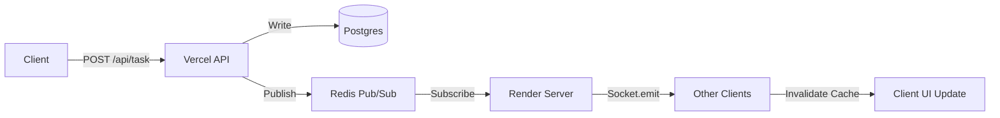

# Corda: Distributed Real-Time Event Architecture


Corda is a high-performance, collaborative task management platform built to handle real-time synchronization at scale. It utilizes a sophisticated distributed event-driven architecture to bridge the gap between serverless frontend environments and persistent stateful notification layers.

## The Architecture (The "Bridge Pattern")

Most real-time applications struggle when deployed to serverless platforms like Vercel because WebSockets require a persistent connection. Corda solves this by implementing an infrastructure bridge using Redis Pub/Sub.

1.  **Mutation Layer (Vercel)**: Next.js API routes handle data mutations (DB writes) and immediately publish events to Upstash Redis.
2.  **Event Bus (Redis)**: Redis acts as a global message broker, broadcasting events across isolated team channels.
3.  **Distribution Layer (Render)**: A dedicated persistent Node.js server subscribes to Redis and pushes events to connected clients via Socket.io.
4.  **Sync Layer (Client)**: A global SocketProvider listens for events and triggers intelligent TanStack Query cache invalidations, providing sub-100ms updates without manual state management.

---

## Technical Features

### Real-Time Collaboration
Instant synchronization of tasks, team changes, and status updates across all connected members using isolated room broadcasting.

### Global Presence System
Visual tracking of team member online/offline status with automated session cleanup and multi-team support.

### Intelligent Task Allocation
A weighted algorithm that matches tasks to team members based on required skills, current workload, and real-time availability.

### Moodle Integration
Automated academic sync using ICS parsing with SHA-256 change detection to minimize redundant database operations and optimize server overhead.

### Hierarchical Task Trees
Support for complex project structures with nested sub-tasks and automated parent-child state synchronization.

---

## Tech Stack

- **Frontend**: Next.js 15 (App Router), TypeScript, Tailwind CSS, Framer Motion
- **Backend Infrastructure**: Socket.io, Redis (Upstash), PostgreSQL (Neon)
- **Data Management**: Prisma ORM, TanStack Query (React Query)
- **Authentication**: NextAuth.js (Google OAuth & Credentials)
- **Engine**: Redis Pub/Sub, Custom EventEmitter patterns

---

## System Design

### Data Mutation Flow


---

## Installation & Setup

### 1. Prerequisite Environments
You will need:
- A Neon.tech PostgreSQL instance.
- An Upstash Redis instance.
- A Google Cloud Console project for OAuth.

### 2. Environment Variables
Create a `.env` file in the root:
```env
DATABASE_URL="your_postgres_url"
REDIS_URL="your_redis_url"
NEXTAUTH_SECRET="your_secret"
NEXTAUTH_URL="http://localhost:3000"
NEXT_PUBLIC_SOCKET_URL="http://localhost:3000"
```

### 3. Local Development
```bash
# Install dependencies
npm install

# Generate Prisma client
npx prisma generate

# Run the unified server (Next.js + Socket.io)
npm run dev
```

---

## Deployment Strategy

1.  **Frontend (Vercel)**: Deploy the Next.js app to handle UI and the API Routes (Publishers).
2.  **Socket Hub (Render)**: Deploy as a Node.js Web Service using `server.ts` (The Subscriber).
3.  **Persistence**: Managed via Neon (Postgres) and Upstash (Redis) for low-latency global access.

---

## License
Corda is open-source software licensed under the MIT License.
